# AWS EKS DevOps Platform


---
## Project Overview

This project demonstrates the deployment of a production-style cloud-native platform on **Amazon Elastic Kubernetes Service (Amazon EKS)** using modern DevOps practices. \
The infrastructure is provisioned using **Terraform**, while applications are containerized using **Docker** and deployed to Kubernetes using **Helm** and Kubernetes manifests. **Argo CD** is used to automate backend application deployment using GitOps principles. \
The platform also integrates:
- Prometheus for metrics collection
- Grafana for visualization
- Alertmanager for alerting
- Fluent Bit, Elasticsearch and Kibana (EFK) for centralized logging
- Amazon Route 53 for DNS management
- AWS Load Balancer Controller for ingress
- Amazon EBS CSI Driver for persistent storage
- Amazon RDS MySQL as the backend database \
The objective of this project was to build an end-to-end Kubernetes platform that closely resembles real-world deployment practices while gaining hands-on experience with Infrastructure as Code (IaC), Kubernetes, GitOps, observability, networking, and cloud-native application deployment.

---

# Table of Contents

- [Architecture](#architecture)
- [Features](#features)
- [Technology Stack](#technology-stack)
- [Repository Structure](#repository-structure)
- [Infrastructure Provisioning](#infrastructure-provisioning)
- [Cluster Configuration & AWS Integrations](#cluster-configuration--aws-integrations)
- [Application Deployment](#application-deployment)
- [Helm Deployment](#helm-deployment)
- [GitOps with Argo CD](#gitops-with-argo-cd)
- [Networking](#networking)
- [Persistent Storage](#persistent-storage)
- [Monitoring](#monitoring)
- [Alerting](#alerting)
- [Centralized Logging](#centralized-logging)
- [DNS & External Access](#dns--external-access)
- [Documentation](#documentation)
- [Project Validation](#project-validation)
- [Future Enhancements](#future-enhancements)

---

# Architecture

The platform combines AWS infrastructure, Kubernetes, GitOps, monitoring, logging, and networking components to deploy and manage a cloud-native application.


---

# Features

## Infrastructure

- Infrastructure provisioning using Terraform
- Multi-AZ Amazon VPC architecture
- Amazon EKS Cluster
- Amazon RDS MySQL
- Amazon EBS CSI Driver
- Route 53 DNS integration

## Application Deployment

- Dockerized Java Spring Boot backend
- Dockerized Python Flask frontend
- Kubernetes Deployment Manifests
- Helm chart based deployment
- ConfigMaps and Secrets
- NGINX Ingress Controller

## GitOps

- Argo CD automated synchronization
- Helm-based backend deployment
- Declarative Kubernetes deployment

## Observability

- Prometheus monitoring
- Grafana dashboards
- Alertmanager alerts
- Fluent Bit log collection
- Elasticsearch log indexing
- Kibana log visualization

---

# Technology Stack

| Category | Technologies |
|-----------|--------------|
| Cloud | AWS |
| Infrastructure as Code | Terraform |
| Programming Languages | Java, Python |
| Containerization | Docker |
| Container Registry | Docker Hub |
| Container Orchestration | Amazon EKS |
| Package Management | Helm |
| GitOps | Argo CD |
| Database | Amazon RDS MySQL |
| Monitoring | Prometheus |
| Dashboards | Grafana |
| Alerting | Alertmanager |
| Logging | Fluent Bit, Elasticsearch, Kibana |
| Networking | Route53, NGINX Ingress Controller, AWS Load Balancer Controller |
| Storage | Amazon EBS CSI Driver |
| Version Control | Git & GitHub |

---

# Repository Structure

```text
aws-eks-devops-platform/
│
├── architecture/
├── application/
│   ├── backend/                     # Java Spring Boot backend
│   └── frontend/                    # Python Flask frontend
│
├── docs/
│   ├── deployment-guide.md          # Complete deployment guide
│   ├── cleanup-guide.md             # Infrastructure cleanup guide
│   ├── architecture.md              # Architecture explanation
│   └── screenshots/
│
├── kubernetes/
│   ├── deployment-manifests/
│   │   ├── backend/
│   │   └── frontend/
│   │
│   ├── helm/
│   │   └── datastore-backend/
│   │
│   ├── networking/
│   ├── monitoring/
│   ├── logging/
│   ├── storage/
│   ├── automation/
│   └── alerting/
│
├── scripts/
│   └── setup-environment.sh
│
├── terraform/
│
├── .gitignore
│
└── README.md
```

---

> **Note**
>
> Detailed deployment steps, architecture explanations, and cleanup procedures are available inside the **docs/** directory.

# Infrastructure Provisioning

The AWS infrastructure for this platform is provisioned using **Terraform**, enabling repeatable and consistent deployments. \
The infrastructure was designed following a production-style architecture with isolated networking, managed Kubernetes, and a managed relational database.

## Provisioned Resources

- Amazon Virtual Private Cloud (VPC)
- Public and Private Subnets across multiple Availability Zones
- Internet Gateway
- NAT Gateway
- Route Tables and Route Table Associations
- Security Groups
- Amazon EKS Cluster
- Amazon EKS Managed Node Group
- Amazon RDS MySQL Database

After the infrastructure is created, Terraform outputs are used to configure Kubernetes access and integrate the remaining platform components.

### Terraform State
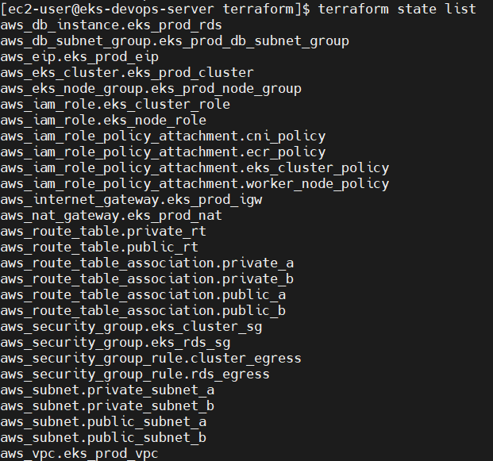

---

# Cluster Configuration & AWS Integrations

After provisioning the infrastructure, additional cluster configuration was completed to prepare the Kubernetes platform for workload deployment.

## Configuration Tasks

- Configured AWS CLI credentials
- Updated kubeconfig for Amazon EKS cluster access
- Installed kubectl
- Installed Helm
- Installed eksctl
- Installed Terraform CLI
- Associated the IAM OIDC Provider with the EKS cluster
- Installed the AWS Load Balancer Controller
- Installed the Amazon EBS CSI Driver
- Imported the automatically created Amazon EKS Cluster Security Group into Terraform
- Updated the Amazon RDS Security Group to allow MySQL traffic from the EKS Cluster Security Group
- Configured the default StorageClass
- Verified cluster connectivity before deploying workloads

### Cluster Configuration

| EKS Cluster | Worker Nodes | Namespaces |
|-------------|---------------|---------------|
| 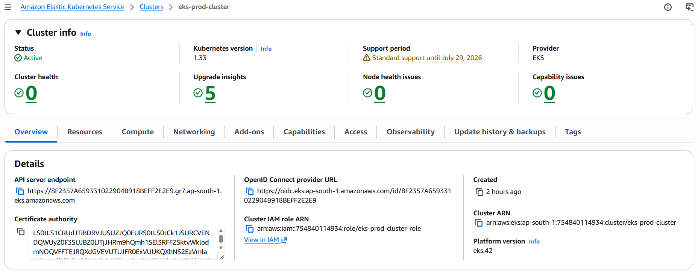 | 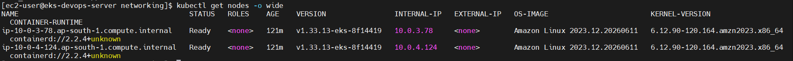 | [!Namespaces](docs/screenshots/cluster/namespaces.png) |

---

# Application Deployment

The platform hosts two containerized applications deployed on Amazon EKS.

## Backend Application

- Java Spring Boot application
- Packaged as a Docker image
- Stored in Docker Hub
- Connects to Amazon RDS MySQL
- Managed using Helm

## Frontend Application

- Python Flask application
- Packaged as a Docker image
- Stored in Docker Hub
- Communicates with the backend service through Kubernetes networking

## Kubernetes Resources

The application deployment includes:

- Namespace
- Deployment
- Service
- ConfigMap
- Secret
- Ingress

### Application

| Frontend | Backend |
|-----------|---------|
| 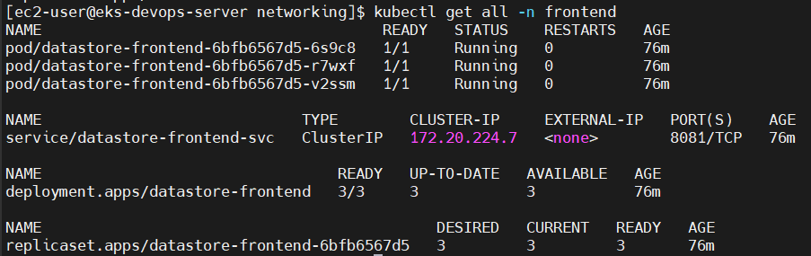 | 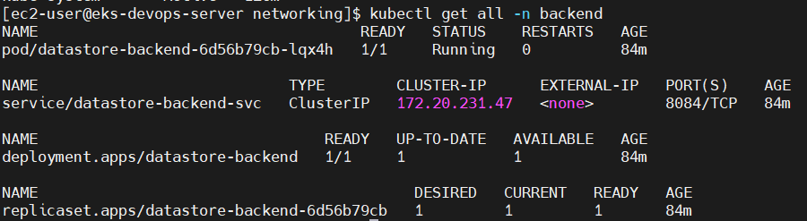 |

---

# Helm Deployment

To simplify application deployment and configuration management, the backend application was packaged as a reusable Helm chart.

The chart includes templates for:

- Namespace
- Deployment
- Service
- ConfigMap
- Secret

Environment-specific configurations are managed using:

- `values.yaml`
- `values-stg.yaml`
- `values-prod.yaml`

Application parameters such as:

- Docker image
- Replica count
- CPU & Memory resources
- Database connection
- Health probes

are configurable through Helm values.

### Helm Structure
[!Helm Details](docs/screenshots/helm/helm-details-1)

---

# GitOps with Argo CD

GitOps was implemented for the backend application using **Argo CD**.

Argo CD continuously monitors the GitHub repository and automatically synchronizes the Kubernetes cluster whenever changes are committed.

The backend Helm chart serves as the desired state, ensuring that the cluster always reflects the latest committed configuration.

## GitOps Validation

The GitOps workflow was validated by:

- Updating the backend replica count
- Pushing the change to GitHub
- Allowing Argo CD to detect the commit
- Automatically synchronizing the deployment
- Scaling the backend application without executing any manual Kubernetes commands

### Argo CD
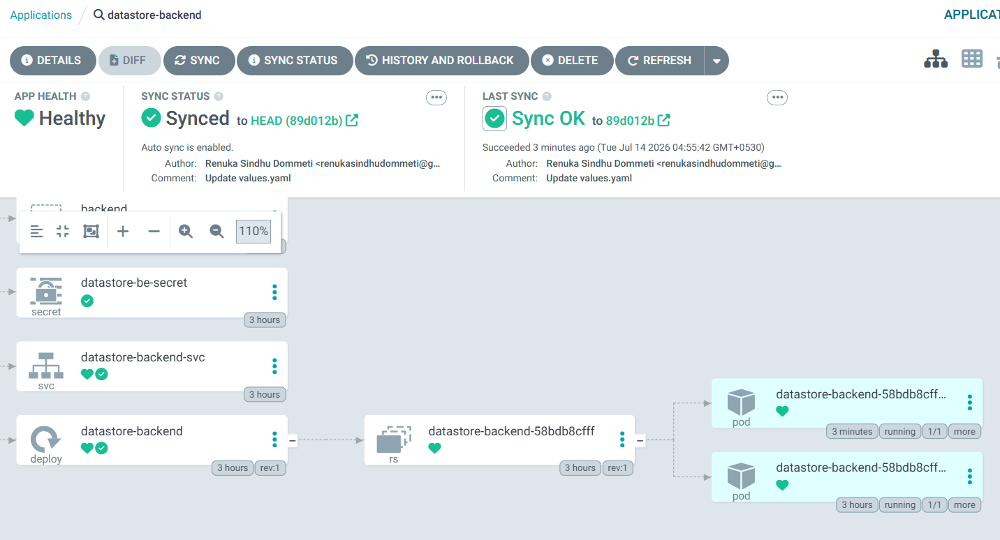

---

# Networking

Application traffic is managed using the **NGINX Ingress Controller**.

The AWS Load Balancer Controller automatically provisions an AWS Application Load Balancer (ALB) to expose Kubernetes services externally.

Ingress resources were configured for:

- Frontend Application
- Argo CD
- Prometheus
- Grafana
- Alertmanager
- Kibana

Amazon Route 53 maps custom DNS records to the AWS Application Load Balancer, providing user-friendly URLs for platform services.

### Networking

| Ingress | AWS Load Balancer |
|----------|-------------------|
| 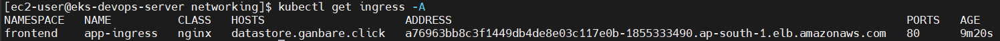 |  |

---

# Persistent Storage

Persistent storage is provided using the **Amazon EBS CSI Driver**.

A custom StorageClass and PersistentVolumeClaim (PVC) dynamically provision Amazon EBS volumes for Kubernetes workloads requiring persistent storage.

## Storage Components

- Amazon EBS CSI Driver
- StorageClass
- PersistentVolumeClaim (PVC)

### Storage

| StorageClass | Persistent Volume |
|--------------|-------------------|
|  |  |

# Monitoring

The Kubernetes platform is monitored using **Prometheus** and **Grafana**, providing real-time visibility into cluster health, infrastructure resources, and application workloads.

## Prometheus

Prometheus continuously scrapes metrics from Kubernetes components and application workloads.

Collected metrics include:

- Kubernetes Cluster Metrics
- Node Metrics
- Pod Metrics
- Container Metrics
- Application Metrics
- CPU Utilization
- Memory Utilization
- Network Metrics

## Grafana

Grafana is integrated with Prometheus as the primary visualization platform.

Implemented dashboards include:

- Kubernetes Cluster Monitoring
- Kubernetes Views (Pods)

These dashboards provide real-time visibility into:

- Cluster health
- Node utilization
- Pod status
- CPU & Memory usage
- Application availability

### Monitoring

| Prometheus Targets | Grafana Dashboard |
|------------|-------------------|
| 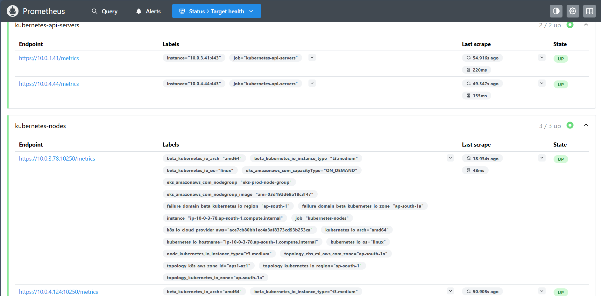 | 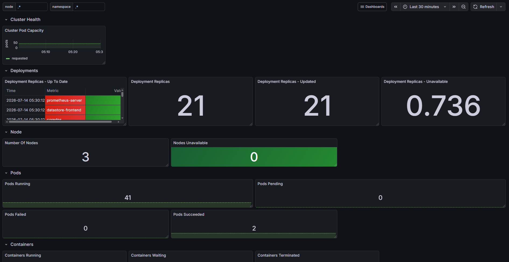 |

---

# Alerting

Alertmanager is integrated with Prometheus to provide centralized alert management.

A custom Prometheus alert rule was created to detect backend application downtime.

## Alert Validation

The monitoring workflow was validated by intentionally scaling the backend deployment to zero replicas.

As expected:

- Backend application became unavailable
- Prometheus detected the failure
- Alert entered the **Firing** state
- Alertmanager received and displayed the alert

This verified the complete monitoring and alerting pipeline.

### Alert Validation

| Alert Firing | Alertmanager |
|------------------|--------------|
| 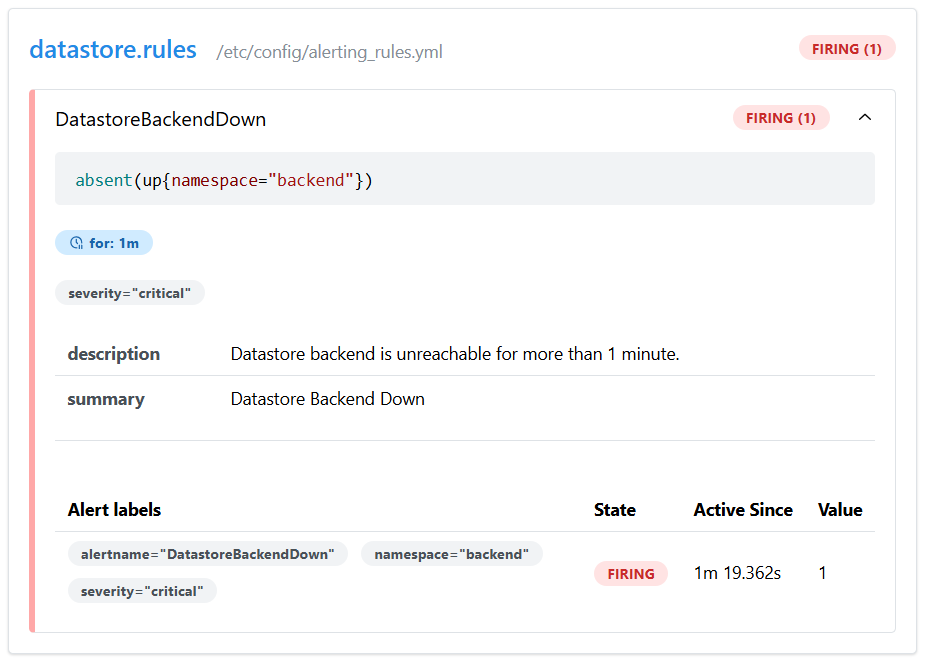 | 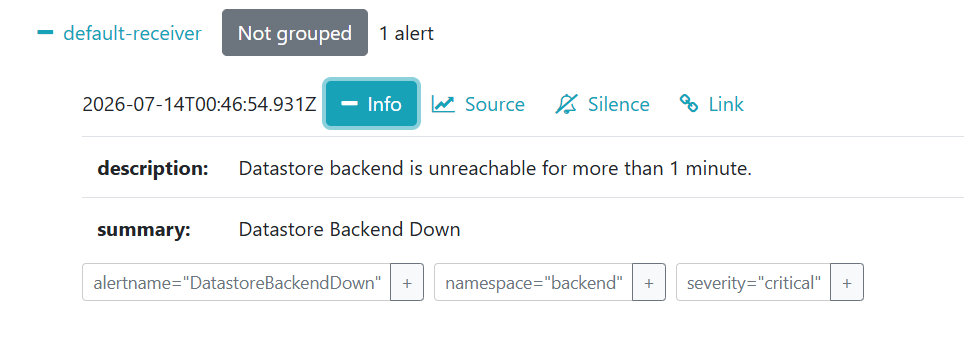 |

---

# Centralized Logging

The platform includes an **EFK (Elasticsearch, Fluent Bit, Kibana)** stack for centralized log collection and visualization.

## Fluent Bit

Fluent Bit is deployed as a DaemonSet to collect logs from Kubernetes nodes.

Responsibilities include:

- Collect container logs
- Forward logs to Elasticsearch
- Lightweight log forwarding

## Elasticsearch

Elasticsearch provides centralized storage and indexing of logs.

Responsibilities include:

- Store application logs
- Index log data
- Enable fast searching and aggregation

## Kibana

Kibana provides a web interface for exploring centralized logs.

Capabilities include:

- Search application logs
- Filter logs
- Visualize indexed data

### Logging
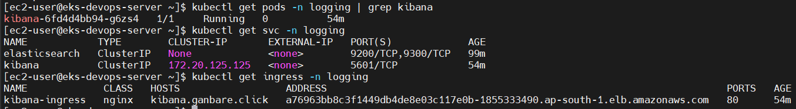

---

# DNS & External Access

Amazon Route 53 was used to configure DNS records for services exposed through the NGINX Ingress Controller.

Configured subdomains include:

- Frontend Application
- Argo CD
- Prometheus
- Grafana
- Alertmanager
- Kibana

Each DNS record routes traffic through the AWS Application Load Balancer created by the AWS Load Balancer Controller, providing user-friendly URLs for accessing platform services.

## DNS
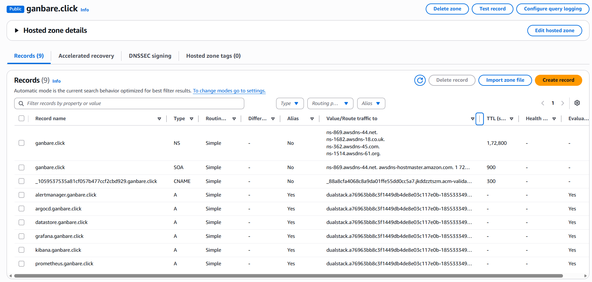

---

# Documentation
Additional documentation is available in the docs directory.

| Document | Description |
|----------|-------------|
| [Deployment Guide](docs/deployment-guide.md) | Complete infrastructure provisioning and deployment steps |
| [Cleanup Guide](docs/cleanup-guide.md) | Remove AWS infrastructure and Kubernetes resources |
| [Architecture](docs/architecture.md) | Detailed architecture explanation |

---

# Project Validation

The following functionality was successfully validated during implementation.

## Infrastructure

- Terraform successfully provisioned AWS infrastructure
- Amazon EKS Cluster became operational
- Amazon RDS database deployed successfully

## Application

- Backend deployed successfully
- Frontend deployed successfully
- Backend connected to Amazon RDS
- Kubernetes Services functioning correctly

## GitOps

- Helm deployment successful
- Argo CD detected Git commits
- Automatic synchronization validated
- Replica scaling automatically applied

## Monitoring

- Prometheus successfully scraped metrics
- Grafana dashboards displayed cluster metrics
- Alertmanager successfully received alerts

## Logging

- Kibana deployed successfully
- Elasticsearch cluster operational
- Fluent Bit configured for log forwarding

## Networking

- AWS Load Balancer created successfully
- Route 53 DNS records resolved correctly
- Ingress routing validated

---

# Future Enhancements

The following improvements can further enhance the platform.

- Expand Helm charts to package the frontend application and remaining Kubernetes components.
- Extend GitOps using Argo CD to manage the complete Kubernetes platform.
- Implement Argo CD ApplicationSets for multi-application deployments.
- Refactor the Terraform configuration into reusable modules.
- Eliminate the manual Amazon EKS Cluster Security Group import by redesigning the infrastructure workflow.
- Upgrade the Amazon EKS cluster to the latest supported Kubernetes version.
- Configure Alertmanager with Slack or Microsoft Teams notifications.
- Implement CI pipelines for automated build, testing, and image publishing.
- Implement Horizontal Pod Autoscaler (HPA).
- Integrate AWS Secrets Manager for secret management.
- Configure cert-manager with Let's Encrypt for HTTPS.
- Implement automated backup and disaster recovery for Amazon RDS.

---

# Acknowledgements

This project was built as part of my hands-on learning journey in AWS, Kubernetes, Terraform, and DevOps engineering.

It demonstrates practical implementation of Infrastructure as Code, Kubernetes administration, GitOps, observability, networking, and cloud-native deployment practices on AWS.

---
